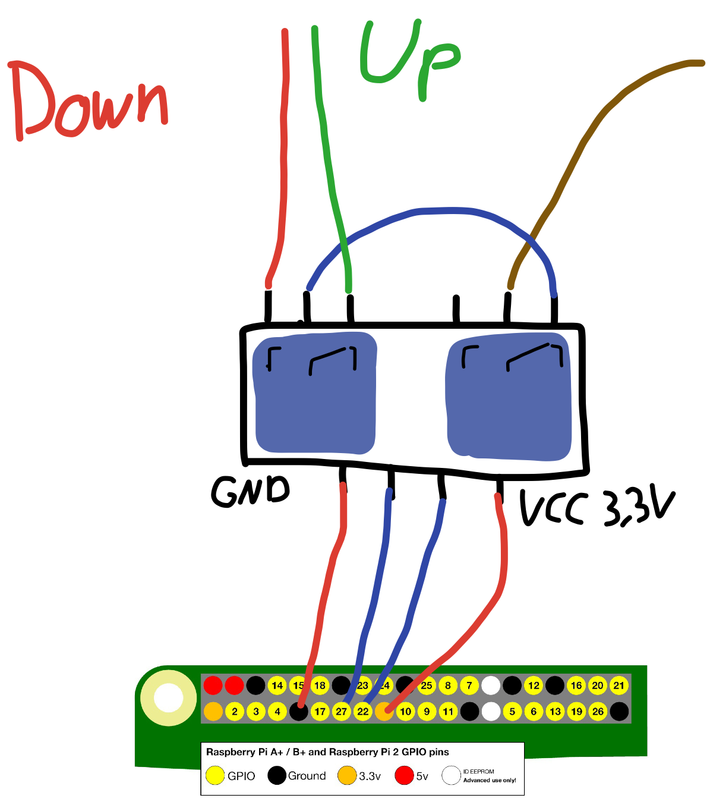

# Python HomeKit Shutter API

Control a shutter or similar wich has a motor with two power lines with GPIO of a RaspberryPi
Made to use with [homebridge](https://github.com/nfarina/homebridge/) and optimized to work with HTTP Plugins like [this](https://github.com/jeffreylanters/homebridge-http-window-covering). Unfortunately it is not optimized to use it with a maintained [fork](https://github.com/crashtestoz/homebridge-http-window-blinds#readme) from the link above, but i will work on that.

Since its Flask default it runs on port 5000

A small [Vue.js](https://vuejs.org) powered, mobile-focused web frontend is included. See ```/static``` .
____

## Prerequisites

1. 1 RaspberryPi with GPIO and Network
2. 2 relays, 4 jumper cables, 1 short piece(5 cm) of normal electric cable
3. Python with Flask and gpiozero installed ( `pip install flask gpiozero` )
4. **experience with working on high currents!**

To gain precise positioning you definetly need to tune the factors in ```config.py```.
Make them bigger => faster, smaller => slower

## General Usage

It provides endpoints for:
- `/status` (returns json {"position": 20} )
- `/up` (no matter where the blinds are)
- `/down` (no matter where the blinds are)
- `/stop` (simply just stop at the current position)
- `/height/<0-100>` (where 0 is shut, 100 open)

In general, all requests send back the current / now desired position.

### Automatic start

`sudo cp homekit.service.sh /etc/init.d/ && sudo chmod +x homekit.service.sh`

### Schema

Wire everything like the schema below, where your brown cable comes from the power source,
red and green are the two lines of the motor.
connect ground and neutral wire directly.


